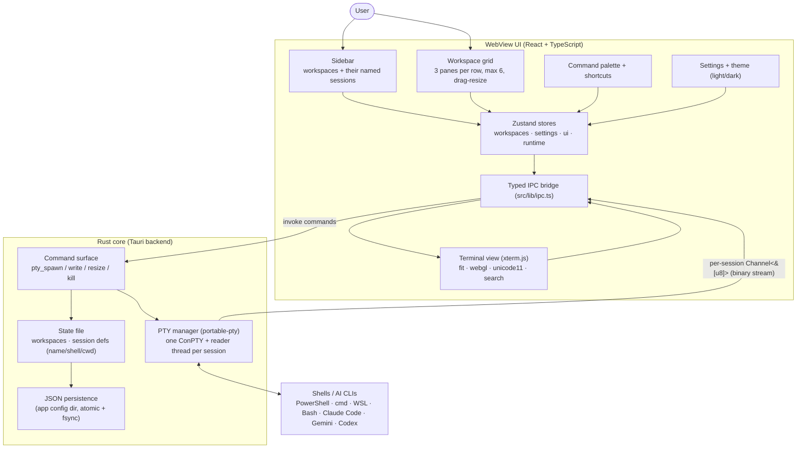

# System diagram - Warsha

## Flow: create + run a session

1. User clicks + (or palette), picks a session type (shell or AI CLI), then a folder
   (default folder / browse / none).
2. Frontend adds the session to the active workspace store; the pane's TerminalView calls
   `pty_spawn` over typed IPC.
3. Rust spawns a ConPTY via `portable-pty`, starts a reader thread, returns.
4. The reader thread streams raw bytes over a per-session `Channel`; the pane's xterm renders.
5. Keystrokes in the focused pane call `pty_write(id, data)`; resize calls `pty_resize`.
6. Workspaces + session defs persist to JSON (debounced + flushed on close) so a restart
   restores each workspace and re-opens its sessions in their folders.
