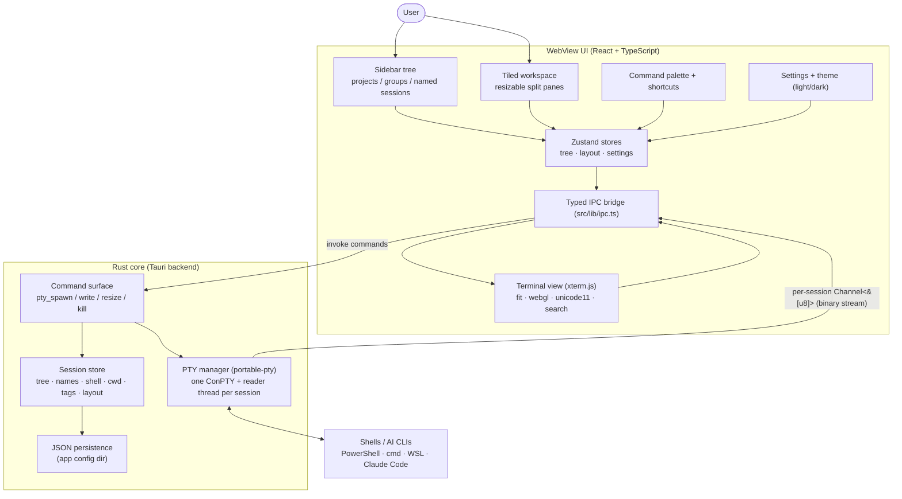

# System diagram — Warsha

## Flow: create + run a session

1. User right-clicks a project in the tree, "New session", names it, picks a shell.
2. Frontend writes the node into the tree store and calls `pty_spawn` over typed IPC.
3. Rust spawns a ConPTY via `portable-pty`, starts a reader thread, returns a `sessionId`.
4. Reader thread streams output as `pty://data/{id}` events; the bound pane's xterm renders.
5. Keystrokes in the focused pane call `pty_write(id, data)`; resize calls `pty_resize`.
6. Tree + layout changes persist to JSON so the workspace restores on next launch.
